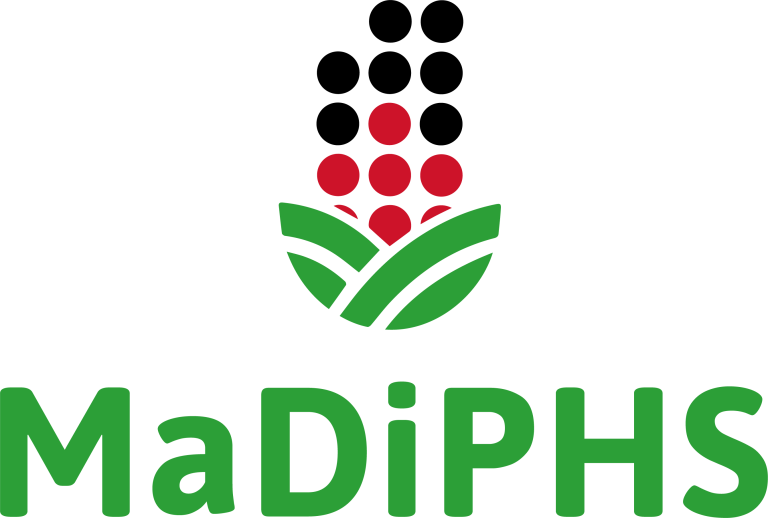

# CKAN Metadata
This repository contains metadata for configuring the [CKAN](https://ckan.org/) installation 
for [MaDiPHS](https://madiphs.org) located at [https://ckan.madiphs.org/](https://ckan.madiphs.org/)

## ckanext-scheming
To create records for MaDiPHS datasets and factsheets, we have used the [ckanext-scheming](https://github.com/ckan/ckanext-scheming) 
extension and added the factsheets-schema.yaml definition. 

**TODO**: split into datasets-schema.yaml and factsheets-schema.yaml (subset of datasets-schema)

## vocabularies
With guidance from Knowmatics we have created vocabularies for a number of categories in the schemas. These can be found in SKOS/RDF format under the `vocabularies` directory. It has been created using [Vocbench3](https://bitbucket.org/art-uniroma2/vocbench3/src/master/)