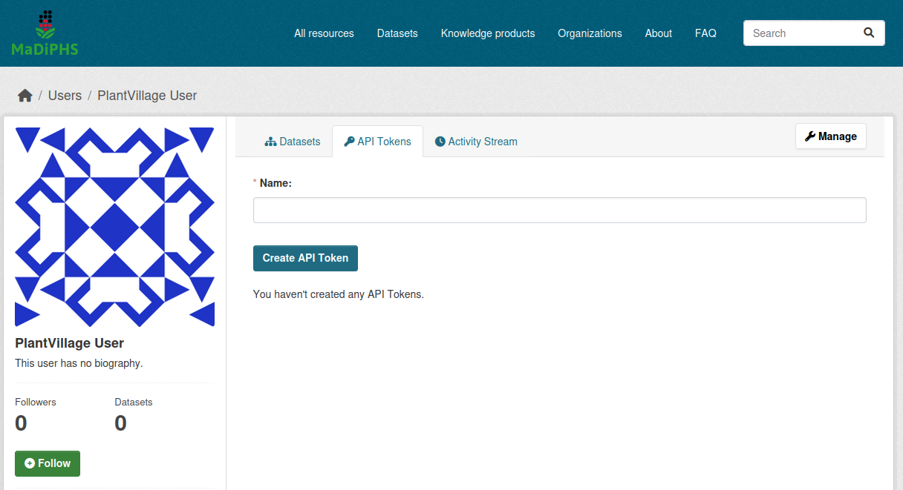

# Utils for CKAN datasets

## How to import datasets defined by ckanext-scheming using CKAN's APIs
The general method of submitting datasets using CKAN's API is:
1. Create an API key for a user having admin privileges in the organization in question.

2. Read and understand [the general documentation for importing datasets](https://docs.ckan.org/en/2.9/api/#example-importing-datasets-with-the-ckan-api)
3. Add the schema specific dataset properties as part of the request. See examples for plant-health-dataset and plant-health-knowledge-product (respectively) below. Full Python examples for posting data can be found in `./import_datasets.py` and `import_factsheets.py`

```json
{
    "type": "plant-health-dataset",
    "name": "presences-of-groundnut-rossette-viral-disease-data",
    "crop": "https://gd.eppo.int/taxon/ARHHY",
    "pest": [
        "https://gd.eppo.int/taxon/GRV000"
    ],
    "title": "Presences of groundnut rossette viral disease data",
    "notes": "pest data - occurrence with gps coordinates, data is collected in the PlantVillage App\n\n### Type\n Pictures",
    "tag_string": "groundnut,rosette,Malawi",
    "author": "",
    "author_email": "",
    "maintainer": "PlantVillage",
    "maintainer_email": "kelvinnyongesa207@gmail.com",
    "owner_org": "plantvillage",
    "language": "eng",
    "creation_date": "2024-02-03 00:00:00",
    "update_frequency": "http://voc.madiphs.org#c_1c97a174",
    "most_recent_update": "2024-02-03 00:00:00",
    "dataset_physical_format": "",
    "dataset_size": "unknown",
    "dataset_location": "",
    "spatial_resolution": "",
    "temporal_resolution": "",
    "record_georeferenced": null,
    "record_timestamp": null,
    "privacy": null,
    "country_codes": [
        "MWI"
    ],
    "license_id": "notspecified"
}
```
*(Above) Data dictionary for a plant-health-dataset. Vocabularies for crops, pests etc. can be found in `../datasets-schema.yaml`*


```json
{
    "type": "plant-health-knowledge-product",
    "name": "practical-information-on-panama-disease-on-bananas-with-picture",
    "crop": "https://gd.eppo.int/taxon/MUBPA",
    "pest": [
        "https://gd.eppo.int/taxon/FUSACB"
    ],
    "title": "Practical information on Panama disease on bananas with picture",
    "notes": "Practical information on Panama disease on bananas with picture. Description of the symptoms. Not much is given about management\n\n### Other information\n n/a",
    "tag_string": "Fungal disease of banana,reddish brown discoloration of vascular tissue",
    "author": "",
    "author_email": "n/a",
    "maintainer": "n/a",
    "maintainer_email": "n/a",
    "owner_org": "plantvillage",
    "language": "000",
    "creation_date": null,
    "update_frequency": "http://voc.madiphs.org#c_d02399d1",
    "most_recent_update": null,
    "dataset_type": "article with photos",
    "dataset_physical_format": "http://voc.madiphs.org#c_31e9a711",
    "country_codes": "{'STP', 'SEN', 'SLE', 'TUN', 'BDI', 'CMR', 'RWA', 'MWI', 'NAM', 'KEN', 'NER', 'ESH', 'ZWE', 'ETH', 'TGO', 'MUS', 'BFA', 'MAR', 'CAF', 'ZMB', 'SSD', 'TCD', 'AGO', 'SDN', 'GIN', 'BWA', 'LBR', 'MRT', 'DZA', 'GNQ', 'COD', 'UGA', 'ERI', 'MOZ', 'ZAF', 'COM', 'SWZ', 'MLI', 'LBY', 'TZA', 'SOM', 'GAB', 'COG', 'DJI', 'GHA', 'GNB', 'CIV', 'EGY', 'MDG', 'GMB', 'NGA', 'BEN', 'SOL', 'LSO', 'SYC'}",
    "license_id": "cc-by-sa"
}
```
*(Above) Data dictionary for a plant-health-knowledge product. Vocabularies for crops, pests etc. can be found in `../factsheets-schema.yaml`*

